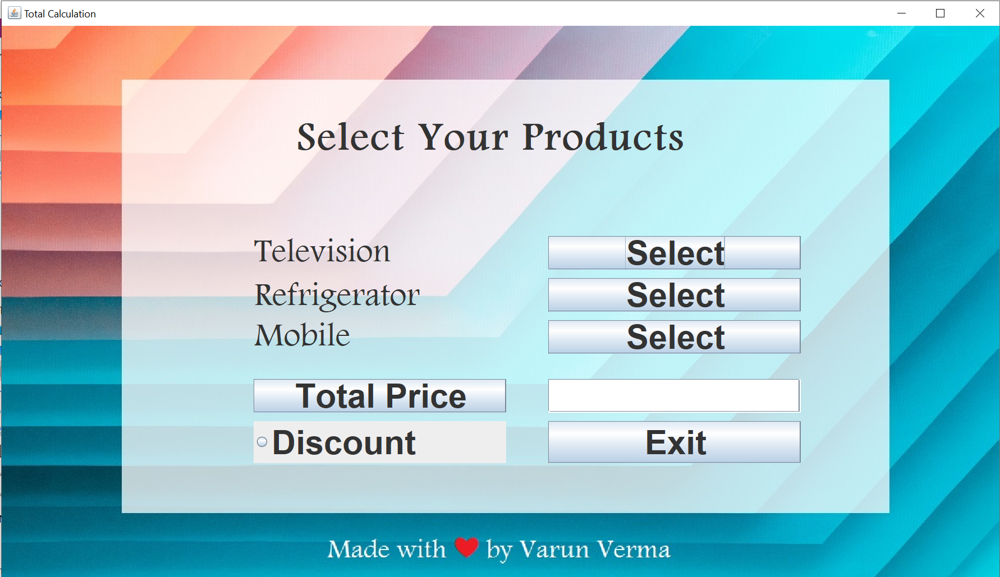
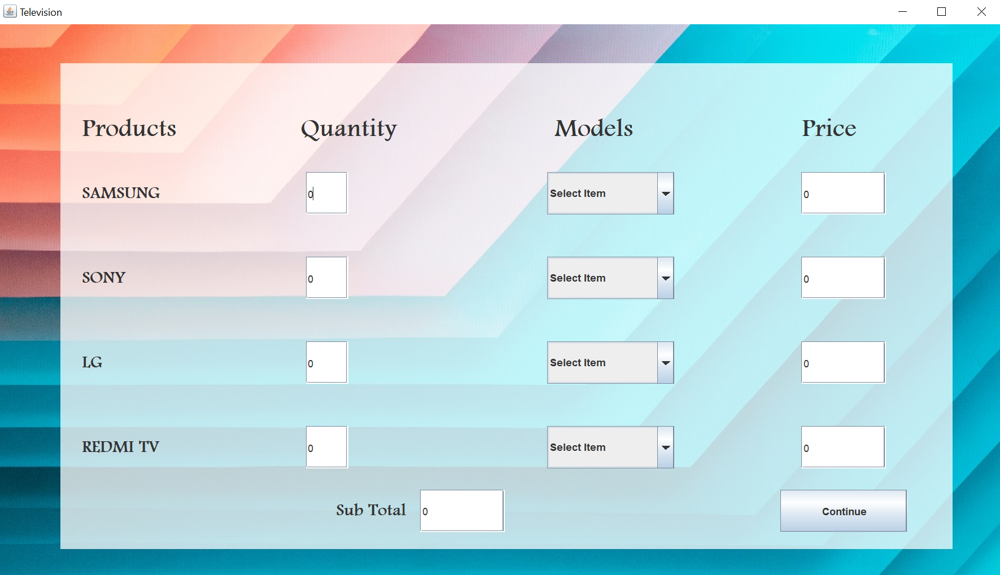
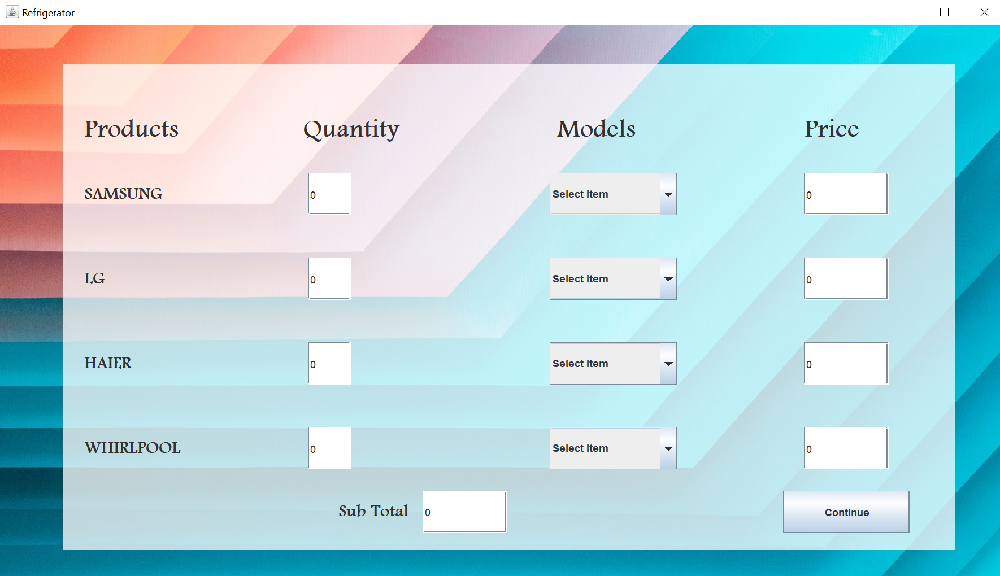
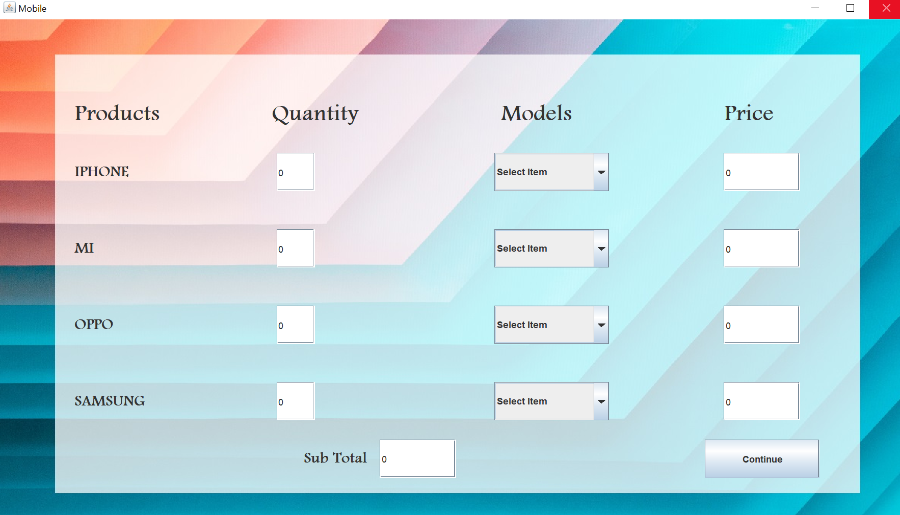

# Price-Calculator
 
## Price Calculator using java SWING and AWT

Steps to Run in your PC :-
 1. Clone (or Download as zip) this repository
 2. Ensure that JDK is already installed in your PC and path is set
 3. Now open the Price Calculator folder you cloned 
 4. Double Click and run the PriceCalculator.jar file
 5. Splash screen like this will be displayed
 
 

 6. After few Seconds Login page will be displayed 
  _ Username => *user*
  _ Password => *1234*
 
 
 
 7. Now main page will we opened, from here you can navigate to Television, Mobile and Refrigerator and select desired product

 

 8. In each of three category (Television, Mobile and Refrigerator) firstly enter the quantity then select model, and if you are done selecting click on      continue

 
 
 

 9. At last click on **Total** to get the total price and on **Discount** to give 10% instant discount.
 10. Click on **Exit** to close the application
 11. Thank you page will be displayed

 

